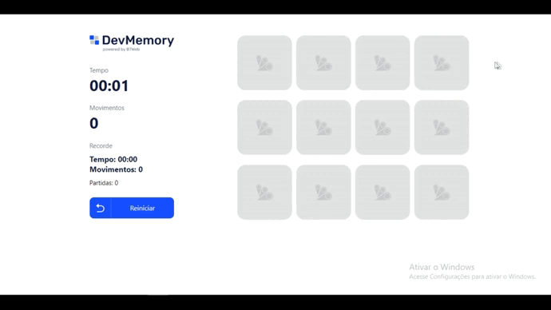
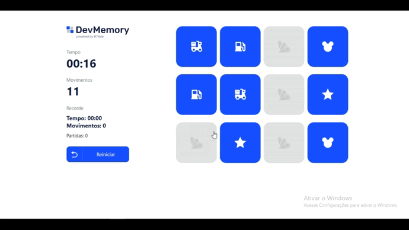
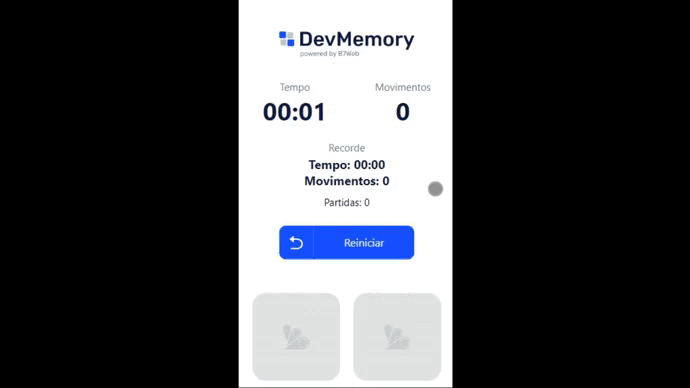

# Memory Game

## | About

This is a memory game that I've made during my course.

## | Overview

## | Record System

If it is your first match, your record will be displayed. The same thing happens once you beat the last record.

The number of matches you've played will be displayed as well.

## | Mobile Version

## | Made Using
<ul>
<li>ReactJS</li>
<li>Typescript</li>
<li>Styled-Components</li>
</ul>

## | How to Run

Make sure "Git" is installed in your PC!

    git clone https://github.com/Bruno-Messias-B-S/Memory-Game.git

### Install
- `npm install`

### To run
- `npm start`

## | Made By
[Bruno Messias](https://www.linkedin.com/in/bruno-messias-bs/)